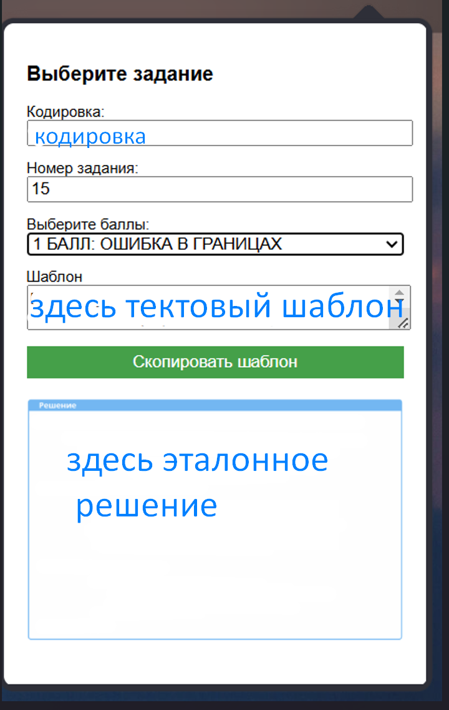

# 🧩 Расширение для проверки домашних заданий

Chrome-расширение, созданное для автоматизации процесса проверки домашних заданий в онлайн-школе.  
Позволяет наставникам и кураторам за секунды вставить шаблон, выбрать балл и загрузить эталонное решение.

---

## 📌 Функциональность

- Выбор кодировки и оценки из выпадающего списка
- Автоматическая подгрузка текстового шаблона
- Вставка эталонного решения (в виде изображения)
- Быстрое копирование готового ответа
- Упрощение рутины для команд наставников

---

## 🛠️ Технологии

- HTML, CSS, JavaScript
- Chrome Extension API
- JSON (для шаблонов и эталонов)
- Python (опциональный скрипт сервера, не обязателен для работы расширения)

---

## 🚀 Установка (ручная)

1. Перейти в `chrome://extensions/`
2. Включить режим разработчика
3. Нажать "Загрузить распакованное расширение"
4. Выбрать папку проекта

---

## 📸 Скриншоты

| Выбор баллов | Готовый шаблон и эталон |
|--------------|--------------------------|
|  |  |

> 🧠 На первом скрине пользователь выбирает кодировку, номер задания и баллы.  
> 🛠 На втором — автоматически подгружается шаблон и эталонное решение, готовое к копированию.

---

## 🙋‍♀️ Автор

Анна Марусина — fullstack-разработчица. Создаю инструменты для оптимизации процессов в edtech-командах.
